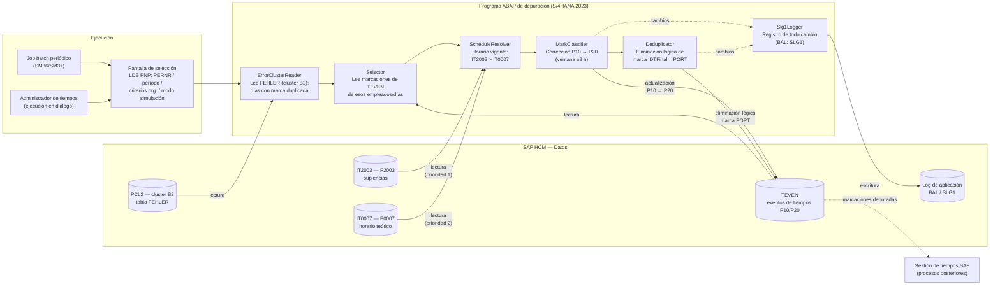
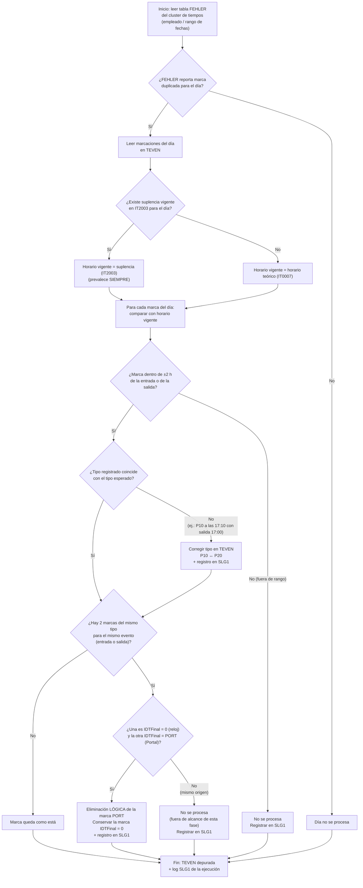

# Documento de Diseño de Software (SDD)
## Programa de Depuración de Marcaciones Duplicadas (TEVEN)

---

> **Nota de origen:** Este SDD fue generado como **borrador base**. El documento fuente
> (Google Docs) no pudo leerse automáticamente porque requiere inicio de sesión, por lo que
> el contenido se construyó a partir de los requisitos indicados en la conversación.
> Las secciones marcadas con **[SUPUESTO]** deben validarse contra el documento original.

| Campo | Valor |
|-------|-------|
| Proyecto | Procesa-marcaciones |
| Versión del documento | 0.3 (borrador) |
| Estado | En revisión |
| Fecha | 2026-07-10 |
| Autor(es) | _Por definir_ |
| Aprobado por | _Por definir_ |

---

## 1. Introducción

### 1.1 Propósito
Este documento describe el diseño del **programa de depuración de marcaciones duplicadas**.
El objetivo del programa es **eliminar de forma lógica las marcas duplicadas** en la tabla
**TEVEN** de SAP HCM. El programa **no calcula horas trabajadas, tardanzas ni horas extra**;
esos cálculos corresponden a los procesos estándar de gestión de tiempos, que consumirán
las marcaciones ya depuradas.

### 1.2 Alcance
**Casuística cubierta en esta fase (única):**

> Eliminar lógicamente las **marcas de Portal** (`IDTFinal = PORT`) que estén **duplicadas**
> con una marca de reloj control (`IDTFinal = 0`) en el **horario de entrada** o en el
> **horario de salida** del empleado.

Para poder identificar correctamente los duplicados, el programa además:
- Lee **primero** la tabla **FEHLER** del **cluster de tiempos** para identificar los días en que la
  evaluación de tiempos reportó una **marca duplicada**; solo esos días entran al procesamiento.
- Lee el **horario teórico** del empleado desde el **infotipo 0007 (Horario de trabajo teórico)** de SAP HCM.
- Lee las **suplencias** desde el **infotipo 2003 (Suplencias)**; las suplencias **prevalecen siempre**
  sobre el horario teórico del IT0007.
- **Discierne el tipo real de una marca** cuando está mal tipificada: por ejemplo, dos marcas de
  entrada (P10) donde la segunda corresponde en realidad a la salida, en cuyo caso se corrige a
  P20 en TEVEN (ver 4.3).

**Fuera de alcance** (en esta fase):
- Cálculo de horas trabajadas, tardanzas, salidas tempranas u horas extra.
- Emparejamiento de jornadas y gestión de asistencia.
- Otras casuísticas de duplicidad (p. ej. duplicados con el mismo origen/`IDTFinal`).
- Exportación a nómina y reportería de asistencia.

### 1.3 Definiciones, acrónimos y abreviaturas
| Término | Definición |
|---------|-----------|
| Marcación | Registro de un evento de entrada o salida de un empleado en un instante dado. |
| TEVEN | Tabla de SAP HCM donde se almacenan los eventos de tiempos (marcaciones). Se accede/actualiza a través del infotipo 2011 (estructura `P2011`). |
| IT2011 / P2011 | Infotipo "Hechos de tiempos": vista de infotipo sobre los eventos de TEVEN; estructura confirmada del sistema. |
| SATZA | Campo "Clase de hecho temporal" (elemento de datos `RETYP`, CHAR 3) en P2011/TEVEN; contiene P10 (entrada) / P20 (salida). |
| TERID | Campo "ID Terminal" (CHAR 4) en P2011/TEVEN; se asume que es el campo referido como `IDTFinal`: `0` = reloj control, `PORT` = Portal. **[PENDIENTE — confirmar]** |
| PDSNR | Número consecutivo de la notificación CDP (NUMC 12); clave unívoca del evento de tiempos. |
| FEHLER | Tabla del cluster de tiempos (cluster B2, resultados de la evaluación de tiempos) que contiene los mensajes/errores generados por la evaluación; en ella se identifican los días con marcas duplicadas. Estructura confirmada del sistema (ver 3.4). |
| ERRTY / ERROR | Campos de FEHLER: tipo (CHAR 1) y número (CHAR 2) de la clase de notificación; identifican el mensaje concreto (p. ej. marca duplicada). |
| Cluster de tiempos | Almacén de resultados de la evaluación de tiempos de SAP HCM (cluster B2, tabla PCL2). |
| SLG1 | Transacción del log de aplicación de SAP; en ella el programa registra todos los cambios realizados. |
| PNP | Base de datos lógica estándar de HR para maestro de personal; provee la pantalla de selección estándar (PERNR, período, criterios organizativos) y la autorización por empleado. |
| P10 | Tipo de evento de tiempos "Entrada" en la tabla TEVEN. |
| P20 | Tipo de evento de tiempos "Salida" en la tabla TEVEN. |
| IDTFinal | Campo que identifica el origen de la marcación: `0` = reloj control, `PORT` = Portal. |
| Infotipo 0007 (IT0007) | Infotipo de SAP HCM "Horario de trabajo teórico": define la regla de plan de horario de trabajo (turno planificado) del empleado. |
| Infotipo 2003 (IT2003) | Infotipo de SAP HCM "Suplencias": registra un horario alternativo que sustituye temporalmente al horario teórico. |
| Suplencia | Cambio temporal de horario/turno registrado en el IT2003; tiene prioridad sobre el horario teórico del IT0007. |
| Horario vigente | Horario efectivo del día para el empleado: la suplencia (IT2003) si existe; en su defecto, el horario teórico (IT0007). |
| Eliminación lógica | Marcado del registro como eliminado sin borrarlo físicamente, preservando el dato original para auditoría. |
| SDD | Software Design Document (Documento de Diseño de Software). |

### 1.4 Referencias
- Documento fuente de requisitos (Google Docs) — _pendiente de incorporar_.
- Estándar de referencia para estructura: IEEE 1016 (Software Design Descriptions).
- **Estándar de Desarrollo SAP S/4 de LATAM Airlines** (`docs/ESTANDAR_DESARROLLO_ABAP.md`): de cumplimiento obligatorio para la codificación de este programa (nomenclatura, seguridad, Clean Code, optimización HANA).

---

## 2. Descripción general

### 2.1 Contexto
El programa opera **dentro del ecosistema SAP HCM**: primero identifica en la tabla **FEHLER** del
cluster de tiempos los días con marcas duplicadas, luego lee esas marcaciones de TEVEN, valida contra
los infotipos 0007 y 2003 para determinar el horario vigente, y actualiza TEVEN si es necesario
(corrección de tipo y eliminación lógica de duplicados de Portal). **Todo cambio se registra en el
log de aplicación SLG1.** Los procesos posteriores de gestión de tiempos consumen las marcaciones
ya depuradas.

```
[FEHLER (cluster de tiempos): días con marca duplicada]
        |
        v
[TEVEN (marcaciones P10/P20)] --> [Programa de depuración] --> [TEVEN depurada] + [Log SLG1]
                                          ^
                                          |
                  [IT2003 (suplencias) > IT0007 (horario teórico)]
```

### 2.2 Funciones principales
1. **Lectura de la tabla FEHLER** del cluster de tiempos para identificar los días con marca duplicada (filtro de entrada del proceso).
2. Selección de las marcaciones de TEVEN de los empleados/días identificados en FEHLER.
3. Determinación del **horario vigente** por empleado y día: suplencia (IT2003) con prioridad sobre horario teórico (IT0007).
4. Discernimiento del tipo real de la marca (corrección P10 ↔ P20) usando ventanas de ~2 horas respecto del horario vigente.
5. Detección de duplicados en el horario de entrada o de salida (marca de reloj control + marca de Portal).
6. **Eliminación lógica** de la marca duplicada con `IDTFinal = PORT`, conservando siempre la de `IDTFinal = 0`.
7. **Registro en SLG1** de todo cambio realizado (correcciones de tipo y eliminaciones lógicas).

### 2.3 Usuarios / actores
| Rol | Descripción |
|-----|-------------|
| Administrador de tiempos / RRHH | Ejecuta o programa el proceso y revisa el log de depuración. |
| Proceso batch (job) | Ejecución periódica programada del programa. **[SUPUESTO]** |
| Gestión de tiempos SAP | Consumidor de las marcaciones depuradas. |

### 2.4 Restricciones y supuestos
- La eliminación es **lógica**, nunca física: la marca original debe permanecer disponible para auditoría.
- El proceso debe ser **idempotente**: reprocesar el mismo rango no debe producir cambios adicionales.
- **[SUPUESTO]** Las marcaciones pueden llegar desordenadas dentro del día.

---

## 3. Arquitectura

### 3.1 Vista de alto nivel



Programa de proceso (batch/bajo demanda) con cuatro bloques:

- **Identificación:** lectura de la tabla FEHLER del cluster de tiempos para detectar los días con marca duplicada.
- **Selección:** lectura de las marcaciones de TEVEN de esos empleados/días.
- **Resolución de horario:** lectura de IT2003 e IT0007 y determinación del horario vigente.
- **Depuración:** discernimiento del tipo de marca, detección de duplicados, actualización de TEVEN si es necesario (eliminación lógica de las marcas PORT) y registro en SLG1.

### 3.2 Componentes
| Componente | Responsabilidad |
|-----------|-----------------|
| `ErrorClusterReader` | Lee la tabla FEHLER del cluster de tiempos e identifica los (empleado, día) con marca duplicada. |
| `Selector` | Lee de TEVEN las marcaciones de los empleados/días identificados en FEHLER. |
| `ScheduleResolver` | Determina el horario vigente por empleado/día leyendo IT2003 (suplencias) e IT0007 (horario teórico), aplicando la precedencia IT2003 > IT0007. |
| `MarkClassifier` | Discierne el tipo real de cada marca (corrección P10 ↔ P20) según el horario vigente y la ventana de ~2 horas. |
| `Deduplicator` | Detecta duplicados en entrada/salida y elimina lógicamente la marca con `IDTFinal = PORT`, conservando la de `IDTFinal = 0`. |
| `Slg1Logger` | Registra en el log de aplicación (SLG1) cada cambio: corrección de tipo y eliminación lógica, con valores original y final, regla aplicada y datos de ejecución. |

### 3.3 Decisiones de diseño
- **Eliminación lógica** en lugar de física, para trazabilidad y posibilidad de reverso.
- Procesamiento **idempotente** y reprocesable por rango de fechas/empleado.
- La regla de precedencia de origen (`0` sobre `PORT`) y la de horarios (IT2003 sobre IT0007) son **fijas**, no parametrizables.
- La ventana de proximidad (~2 horas) debería ser **parametrizable**. **[SUPUESTO]**

### 3.4 Entorno técnico de implementación
- **Lenguaje/plataforma:** ABAP sobre **SAP S/4HANA 2023**, cumpliendo el **Estándar de Desarrollo SAP S/4 de LATAM** (`docs/ESTANDAR_DESARROLLO_ABAP.md`).
- **Nombre del programa según estándar:** `ZHHRR_781` (Z + frente H "Recursos Humanos" + módulo HR + tipo R "Reporte" + correlativo 781). Includes: `ZHHRR_781_TOP`, `ZHHRR_781_SEL`, `ZHHRR_781_CLA`, `ZHHRR_781_F00` (subrutinas: importación del cluster B2, ya que las macros `RP-IMP-*` no se admiten en contexto OO). Fuentes en `src/`.
- **Tipo de objeto:** programa ejecutable (report) HR con **base de datos lógica PNP** en la pantalla
  inicial (selección estándar por número de personal, período y criterios organizativos, con chequeo
  de autorizaciones HR incluido), ejecutable en batch (job) y en diálogo, con modo de prueba/simulación.
  La lectura de empleados se realiza vía `GET PERNR` de la LDB PNP. **[SUPUESTO el modo simulación]**
- **Objetos y estructuras estándar previstos** (a confirmar contra el sistema):

| Acceso | Objeto/estructura prevista |
|--------|---------------------------|
| Marcaciones | **Estructura confirmada: infotipo 2011 (`P2011`), vista sobre `TEVEN`.** Campos relevantes: `PERNR` (NUMC 8), `LDATE`/`LTIME` (fecha/hora lógica), `SATZA` (elem. `RETYP`, CHAR 3) = P10/P20, `TERID` (CHAR 4) — se asume que es el campo referido como `IDTFinal` (`0` reloj / `PORT` Portal) **[PENDIENTE — confirmar]** —, `PDSNR` (NUMC 12) como clave unívoca del evento, `ORIGF` (origen de mensaje CDP), y campos de cliente libres `PDC_USRUP` (CHAR 20) / `USER2` (CHAR 40) disponibles p. ej. para marcar la eliminación lógica. La actualización se hará por la vía estándar del IT2011 (p. ej. `HR_INFOTYPE_OPERATION`), no por escritura directa a TEVEN. **[SUPUESTO — confirmar mecanismo]** |
| Mensajes de evaluación de tiempos | **Estructura confirmada: tabla `FEHLER` del cluster B2 (`PCL2`)**, importada con las herramientas estándar del cluster. Campos relevantes: `LDATE`/`LTIME` (fecha/hora lógica), `ERRTY` (tipo de clase de notificación, CHAR 1), `ERROR` (número de la clase de notificación, CHAR 2), `MESTY` (tipo de mensaje: E=Error, A=interrupción, ' '=indicación), `PDSNR` (NUMC 12, **referencia directa al evento de TEVEN/IT2011 implicado**), `STATUS` (status de tratamiento del mensaje), `UTEXT` (texto adicional). **[PENDIENTE — confirmar valores de `ERRTY`/`ERROR` que identifican la marca duplicada]** |
| Horario teórico | Infotipo 0007 (estructura `P0007`) y determinación del horario del día a partir de la regla de plan de horario de trabajo. |
| Suplencias | Infotipo 2003 (estructura `P2003`). |
| Log de aplicación | Framework BAL (SLG1): funciones `BAL_LOG_CREATE`, `BAL_LOG_MSG_ADD`, `BAL_DB_SAVE`, con objeto/subobjeto propios del programa. **[PENDIENTE — definir objeto/subobjeto]** |

- **Nota:** no se iniciará la codificación hasta la aprobación explícita de este diseño y la confirmación de las estructuras pendientes.

---

## 4. Diseño detallado

### 4.1 Flujo de procesamiento



Pasos:
1. **Identificación (FEHLER):** para cada empleado entregado por la **LDB PNP** (`GET PERNR`, según la
   selección de la pantalla inicial) se lee la tabla **FEHLER** del cluster de tiempos del período y se
   identifican, por los campos `ERRTY`/`ERROR`, los días en los que la evaluación de tiempos reportó una
   **marca duplicada**; el campo `PDSNR` referencia directamente la marca implicada en TEVEN. Los días
   sin ese error no se procesan.
2. **Selección:** se leen de TEVEN las marcaciones de los empleados/días identificados en el paso 1.
3. **Resolución de horario vigente:** para cada empleado y día se consulta primero el **IT2003 (suplencias)**;
   si existe una suplencia vigente para la fecha, ese es el horario a aplicar. Solo si no hay suplencia se
   toma el **horario teórico del IT0007**.
4. **Discernimiento del tipo de marca (P10/P20):** usando el horario vigente y ventanas de ~2 horas, se
   determina si cada marca corresponde a la entrada o a la salida; si está mal tipificada, se corrige en TEVEN (ver 4.3).
5. **Detección de duplicados:** se identifican los casos con dos marcas del mismo tipo (dos P10 o dos P20)
   asociadas al mismo evento del día (entrada o salida).
6. **Actualización de TEVEN:** si corresponde, se elimina lógicamente la marca con `IDTFinal = PORT` y se
   conserva la de `IDTFinal = 0` (ver 4.4).
7. **Registro en SLG1:** siempre que exista un cambio (corrección de tipo o eliminación lógica), se
   registra en el log de aplicación **SLG1** según el programa.

### 4.2 Resolución del horario vigente (IT0007 vs IT2003)
```
Para cada (empleado, fecha):
    suplencia = leer_IT2003(empleado, fecha)
    si existe suplencia vigente:
        horario_vigente = horario de la suplencia (IT2003)   // prevalece SIEMPRE
    si no:
        horario_vigente = horario teórico (IT0007)
```
Reglas:
- La suplencia del IT2003 **siempre está por encima** del horario teórico del IT0007.
- Si existen múltiples suplencias solapadas para la misma fecha, se registra en SLG1 y el día
  se excluye del procesamiento automático. **[SUPUESTO — validar criterio de desempate]**
- El log SLG1 debe indicar la fuente del horario aplicado (IT2003 o IT0007) para cada día procesado.

### 4.3 Discernimiento del tipo de marca (P10 ↔ P20)
El programa debe **discernir el tipo real de una marca** cuando el tipo registrado no corresponde
con el horario vigente del empleado.

**Ejemplo de referencia:** un empleado con horario 8:00–17:00 registra dos marcas de entrada (P10),
una a las 8:00 y otra a las 17:10. La segunda marca claramente corresponde a la salida, por lo que
el programa debe **cambiarla a P20 (salida) en la tabla TEVEN**.

Regla de proximidad:
- Se usa una **ventana de aproximadamente 2 horas** respecto de la hora de entrada o de salida del
  horario vigente: la marca se asocia al evento cuya hora planificada esté dentro de ese rango.

```
Para cada marca del día:
    si |hora_marca − hora_entrada_horario_vigente| <= 2 horas:
        tipo_esperado = P10 (entrada)
    si no, si |hora_marca − hora_salida_horario_vigente| <= 2 horas:
        tipo_esperado = P20 (salida)
    si no:
        no se procesa la marca; se registra en SLG1 (fuera de rango)

    si tipo_registrado ≠ tipo_esperado:
        actualizar tipo de evento en TEVEN (P10 ↔ P20)
        registrar en SLG1 (valor original, valor nuevo, motivo)
```
- Toda reclasificación queda **auditada en SLG1**.
- Si una marca cae dentro de ambas ventanas (turnos muy cortos) o de ninguna, **no se corrige
  automáticamente**; solo se registra en SLG1. **[SUPUESTO — validar criterio]**

### 4.4 Eliminación lógica de duplicados (campo IDTFinal) — casuística única de esta fase
Cuando en el horario de entrada o en el horario de salida existen **dos marcas del mismo tipo**
(dos P10 o dos P20) correspondientes al mismo evento —típicamente porque el empleado marcó por el
**reloj control** y además por el **Portal**— se aplica la siguiente regla fija:

- **Siempre prevalece** la marca con `IDTFinal = 0` (reloj control).
- **Siempre se elimina lógicamente** la marca duplicada con `IDTFinal = PORT` (Portal).

```
Si existen 2 marcas del mismo tipo (P10 o P20) para el mismo evento del día:
    si una tiene IDTFinal = PORT y la otra IDTFinal = 0:
        eliminar LÓGICAMENTE la marca con IDTFinal = PORT
        conservar la marca con IDTFinal = 0
    si no (ambas del mismo origen):
        no se procesa; se registra en SLG1   // fuera del alcance de esta fase
```
Notas:
- Esta regla se aplica **después** del discernimiento de tipo (4.3), de modo que primero se
  reclasifiquen las marcas mal tipificadas y luego se resuelvan los duplicados verdaderos.
- La eliminación es **lógica**: el registro original se conserva marcado como eliminado.
- Toda eliminación queda registrada en el log de aplicación SLG1.

### 4.5 Casos y tratamiento
| Caso | Tratamiento |
|------|-------------|
| Día sin error de marca duplicada en FEHLER | No se procesa (filtro de entrada del proceso). |
| Marca de Portal (PORT) duplicada con marca de reloj (0) en entrada o salida | **Eliminación lógica de la marca PORT** (casuística de esta fase) + registro en SLG1. |
| Marca con tipo incorrecto (ej. dos P10, una en la hora de salida) | Corrección P10 ↔ P20 en TEVEN según horario vigente y ventana de ~2 h + registro en SLG1. |
| Dos marcas del mismo tipo con igual origen (`IDTFinal`) | No se procesa; se registra en SLG1. Fuera del alcance de esta fase. |
| Marca fuera de las ventanas de ±2 h | No se procesa; se registra en SLG1. |
| Suplencias solapadas en la misma fecha | Día excluido del proceso automático; se registra en SLG1. **[SUPUESTO]** |
| Reproceso del mismo rango | Idempotente: no genera cambios adicionales. |

---

## 5. Modelo de datos

### 5.1 Datos de entrada (SAP HCM)
- **FEHLER — Mensajes de la evaluación de tiempos (cluster B2)** (`LDATE` fecha lógica, `LTIME` hora lógica,
  `ERRTY` tipo de clase de notificación, `ERROR` número de la clase de notificación, `MESTY` tipo de mensaje
  (E/A/' '), `PDSNR` referencia directa al evento de TEVEN implicado, `STATUS` status de tratamiento,
  `UTEXT` texto adicional). Se usa como filtro de entrada: solo se procesan los días/marcas con mensaje de
  **marca duplicada**. El `PDSNR` permite identificar exactamente la marca señalada por la evaluación.
  **[PENDIENTE — confirmar valores de `ERRTY`/`ERROR` de la marca duplicada]**
- **TEVEN / IT2011 (`P2011`) — Evento de tiempos** (`PERNR`, `LDATE` fecha lógica, `LTIME` hora lógica,
  `SATZA` = P10 entrada | P20 salida, `TERID` = 0 reloj control | PORT Portal (campo referido como `IDTFinal`),
  `PDSNR` clave unívoca del evento, `ORIGF` origen CDP, `PDC_USRUP`/`USER2` campos de cliente libres).
  Indicador de eliminación lógica: por definir (posible uso de `PDC_USRUP`/`USER2`). **[PENDIENTE]**
- **IT0007 — Horario teórico** (`employee_id`, fecha_inicio, fecha_fin, regla de plan de horario de trabajo). **[SUPUESTO — validar campos]**
- **IT2003 — Suplencia** (`employee_id`, fecha_inicio, fecha_fin, tipo de suplencia, turno/horario sustituto). **Prevalece sobre el IT0007.** **[SUPUESTO — validar campos]**

### 5.2 Datos de salida
- **TEVEN actualizada:** marcas corregidas (P10 ↔ P20) y marcas PORT duplicadas eliminadas lógicamente.
- **Log de aplicación SLG1** (objeto/subobjeto de log del programa): un registro por cada cambio, con
  fecha/hora de ejecución, PERNR, marca afectada, acción (corrección | eliminación lógica | no procesada),
  valores original y final, regla aplicada y fuente del horario (IT2003 o IT0007).

---

## 6. Interfaces

### 6.1 Interfaces con SAP HCM
- **FEHLER (cluster de tiempos, B2):**
  - Lectura de los mensajes de la evaluación de tiempos por empleado y fecha (importación del cluster PCL2).
  - Identificación de los días con mensaje de **marca duplicada** (filtro de entrada del proceso), por los campos `ERRTY`/`ERROR`.
  - Cruce con TEVEN/IT2011 mediante el campo `PDSNR`, que referencia directamente la marca implicada.
- **TEVEN / IT2011 (eventos de tiempos):**
  - Lectura de marcaciones (`SATZA` P10/P20, `TERID` 0/PORT, `PDSNR` como clave).
  - **Actualización:** cambio de clase de hecho (`SATZA` P10 ↔ P20) y **eliminación lógica** de marcas duplicadas con `TERID = PORT`.
  - Mecanismo previsto: vía estándar del infotipo 2011 (p. ej. `HR_INFOTYPE_OPERATION`), no escritura directa a TEVEN. **[SUPUESTO — confirmar]**
- **IT0007 (Horario de trabajo teórico):** lectura del plan de horario de trabajo del empleado.
- **IT2003 (Suplencias):** lectura de suplencias vigentes por empleado y fecha.
- **Log de aplicación (SLG1):**
  - Escritura de todos los cambios realizados por el programa (objeto/subobjeto de log propios del programa).
  - Consulta posterior de los logs vía transacción SLG1.

### 6.2 Ejecución
- **Pantalla inicial con base de datos lógica PNP:** selección estándar HR por número de personal,
  período y criterios organizativos; las autorizaciones por empleado las gestiona la propia LDB.
- Ejecución como **job batch** periódico y/o bajo demanda.
- Modo de prueba (simulación sin actualizar TEVEN). **[SUPUESTO]**

---

## 7. Requisitos no funcionales **[SUPUESTO]**
| Categoría | Requisito |
|-----------|-----------|
| Auditabilidad | Todo cambio queda registrado en el log de aplicación SLG1; la eliminación es lógica, nunca física. |
| Confiabilidad | Proceso idempotente y reprocesable por rango. |
| Rendimiento | Procesar el volumen diario de marcaciones dentro de la ventana batch. |
| Seguridad | Ejecución restringida a roles autorizados; trazabilidad de quién ejecutó el proceso. |
| Operabilidad | Modo simulación (test) antes de actualizar TEVEN. |

---

## 8. Asuntos pendientes / A validar contra el documento fuente
- [x] Estructura de TEVEN/IT2011 (`P2011`) — **recibida y documentada**.
- [ ] Confirmar que el campo referido como `IDTFinal` es `TERID` (CHAR 4, valores `0` / `PORT`).
- [ ] Definir el indicador de eliminación lógica (¿campo de cliente `PDC_USRUP`/`USER2`, u otro mecanismo?).
- [ ] Confirmar el mecanismo de actualización: vía IT2011 (`HR_INFOTYPE_OPERATION`) vs. otro.
- [ ] Mecanismo de lectura del cluster B2 utilizado en el sistema (macros/includes estándar o función Z).
- [ ] Mecanismo de lectura de IT0007 e IT2003 y de actualización de TEVEN (BAPI, módulo Z, actualización directa).
- [x] Estructura de FEHLER (cluster B2) — **recibida y documentada**.
- [ ] Valores exactos de `ERRTY`/`ERROR` en FEHLER que identifican la "marca duplicada".
- [ ] Confirmar si tras depurar se debe actualizar el `STATUS` del mensaje en FEHLER (marcarlo como tratado) o si se deja que la siguiente evaluación de tiempos lo limpie.
- [ ] Objeto y subobjeto del log de aplicación (SLG1) a utilizar por el programa.
- [ ] Campo/indicador exacto para la eliminación lógica en TEVEN.
- [ ] Confirmar si la ventana de proximidad de ~2 horas es fija o parametrizable, y su valor exacto.
- [ ] Criterio cuando una marca cae en ambas ventanas o en ninguna.
- [ ] Criterio ante suplencias solapadas en la misma fecha.
- [ ] Parámetros de ejecución del job (periodicidad, selección, modo simulación).
- [ ] Futuras casuísticas de duplicidad a incorporar en fases posteriores.
